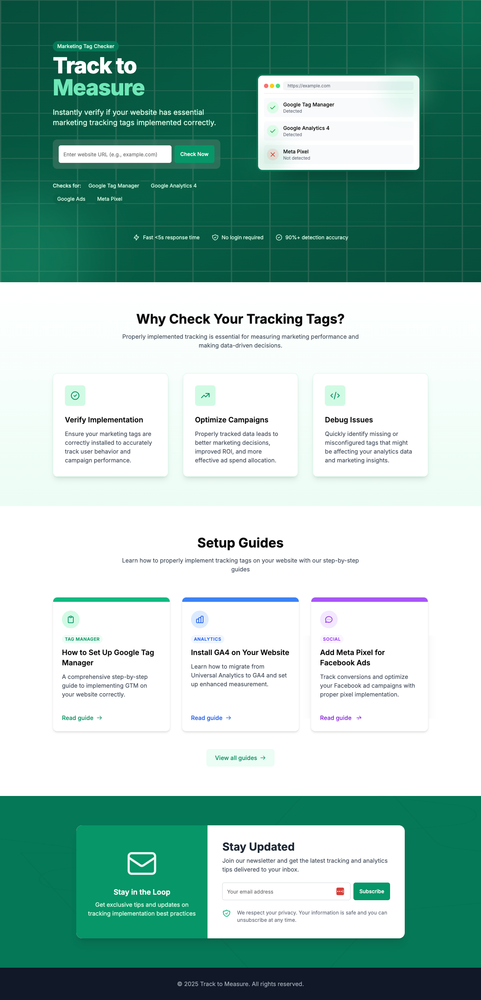

# Track to Measure

A web application that helps users verify if their websites have essential marketing tracking tags implemented correctly.



## Overview

Track to Measure is a tool designed to help marketers and developers quickly check if a website has properly implemented essential marketing tracking tags such as Google Tag Manager, Google Analytics 4, Google Ads Conversion, and Meta Pixel. The application provides instant feedback and guides for setting up missing tags.

## Features

- **Instant Tag Detection**: Check any website for the presence of essential marketing tags
- **Comprehensive Tag Support**: Detects Google Tag Manager, Google Analytics 4, Google Ads Conversion, and Meta Pixel
- **Setup Guides**: Detailed step-by-step guides for implementing each tracking tag
- **Newsletter Subscription**: Stay updated with the latest tracking implementation best practices
- **Responsive Design**: Works seamlessly on desktop and mobile devices

## Technologies Used

- **Frontend**: Next.js 15, React, TypeScript, Tailwind CSS
- **Backend**: Next.js API Routes, Server Actions
- **Database**: Supabase
- **HTML Parsing**: Cheerio, Axios
- **Form Validation**: Zod

## Getting Started

### Prerequisites

- Node.js 18.x or higher
- npm or yarn
- Supabase account

### Installation

1. Clone the repository:
   ```bash
   git clone https://github.com/ahmadlufiau/track-to-measure
   cd track-to-measure